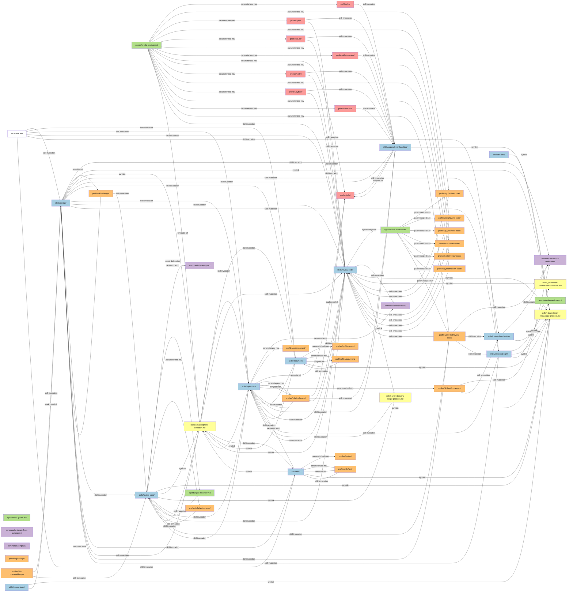

<!-- Generated by `make plugin-graph-docs` — do not edit by hand. -->

```mermaid
flowchart LR
	README_md["README.md"]
	agents_code_reviewer_md["agents/code-reviewer.md"]
	agents_design_reviewer_md["agents/design-reviewer.md"]
	agents_eval_grader_md["agents/eval-grader.md"]
	agents_profile_resolver_md["agents/profile-resolver.md"]
	agents_spec_reviewer_md["agents/spec-reviewer.md"]
	commands_chain_of_verification_["commands/chain-of-verification/"]
	commands_migrate_from_taskmaster_["commands/migrate-from-taskmaster/"]
	commands_review_code_["commands/review-code/"]
	commands_review_spec_["commands/review-spec/"]
	commands_template_["commands/template/"]
	profiles_go_["profiles/go/"]
	profiles_go_design_["profiles/go/design/"]
	profiles_go_document_["profiles/go/document/"]
	profiles_go_implement_["profiles/go/implement/"]
	profiles_go_review_code_["profiles/go/review-code/"]
	profiles_go_test_["profiles/go/test/"]
	profiles_java_["profiles/java/"]
	profiles_java_review_code_["profiles/java/review-code/"]
	profiles_js_ts_["profiles/js_ts/"]
	profiles_js_ts_review_code_["profiles/js_ts/review-code/"]
	profiles_k8s_operator_["profiles/k8s-operator/"]
	profiles_k8s_operator_design_["profiles/k8s-operator/design/"]
	profiles_k8s_["profiles/k8s/"]
	profiles_k8s_design_["profiles/k8s/design/"]
	profiles_k8s_document_["profiles/k8s/document/"]
	profiles_k8s_implement_["profiles/k8s/implement/"]
	profiles_k8s_review_code_["profiles/k8s/review-code/"]
	profiles_k8s_review_spec_["profiles/k8s/review-spec/"]
	profiles_k8s_test_["profiles/k8s/test/"]
	profiles_kotlin_["profiles/kotlin/"]
	profiles_kotlin_review_code_["profiles/kotlin/review-code/"]
	profiles_python_["profiles/python/"]
	profiles_python_review_code_["profiles/python/review-code/"]
	profiles_skill_md_["profiles/skill-md/"]
	profiles_skill_md_implement_["profiles/skill-md/implement/"]
	profiles_skill_md_review_code_["profiles/skill-md/review-code/"]
	skills__shared_capy_knowledge_protocol_md["skills/_shared/capy-knowledge-protocol.md"]
	skills__shared_pal_codereview_invocation_md["skills/_shared/pal-codereview-invocation.md"]
	skills__shared_profile_detection_md["skills/_shared/profile-detection.md"]
	skills__shared_review_scope_protocol_md["skills/_shared/review-scope-protocol.md"]
	skills_chain_of_verification_["skills/chain-of-verification/"]
	skills_dependency_handling_["skills/dependency-handling/"]
	skills_design_["skills/design/"]
	skills_diff_skill_["skills/diff-skill/"]
	skills_document_["skills/document/"]
	skills_implement_["skills/implement/"]
	skills_merge_docs_["skills/merge-docs/"]
	skills_review_code_["skills/review-code/"]
	skills_review_design_["skills/review-design/"]
	skills_review_spec_["skills/review-spec/"]
	skills_test_["skills/test/"]
	README_md -->|skill-invocation| skills_design_
	README_md -->|skill-invocation| skills_document_
	README_md -->|skill-invocation| skills_implement_
	README_md -->|skill-invocation| skills_review_code_
	README_md -->|skill-invocation| skills_review_design_
	README_md -->|skill-invocation| skills_test_
	agents_code_reviewer_md -->|parameterized-nav| profiles_go_review_code_
	agents_code_reviewer_md -->|parameterized-nav| profiles_java_review_code_
	agents_code_reviewer_md -->|parameterized-nav| profiles_js_ts_review_code_
	agents_code_reviewer_md -->|parameterized-nav| profiles_k8s_review_code_
	agents_code_reviewer_md -->|parameterized-nav| profiles_kotlin_review_code_
	agents_code_reviewer_md -->|parameterized-nav| profiles_python_review_code_
	agents_code_reviewer_md -->|parameterized-nav| profiles_skill_md_review_code_
	agents_profile_resolver_md -->|parameterized-nav| profiles_go_
	agents_profile_resolver_md -->|parameterized-nav| profiles_go_review_code_
	agents_profile_resolver_md -->|parameterized-nav| profiles_java_
	agents_profile_resolver_md -->|parameterized-nav| profiles_java_review_code_
	agents_profile_resolver_md -->|parameterized-nav| profiles_js_ts_
	agents_profile_resolver_md -->|parameterized-nav| profiles_js_ts_review_code_
	agents_profile_resolver_md -->|parameterized-nav| profiles_k8s_operator_
	agents_profile_resolver_md -->|parameterized-nav| profiles_k8s_
	agents_profile_resolver_md -->|parameterized-nav| profiles_k8s_review_code_
	agents_profile_resolver_md -->|parameterized-nav| profiles_kotlin_
	agents_profile_resolver_md -->|parameterized-nav| profiles_kotlin_review_code_
	agents_profile_resolver_md -->|parameterized-nav| profiles_python_
	agents_profile_resolver_md -->|parameterized-nav| profiles_python_review_code_
	agents_profile_resolver_md -->|parameterized-nav| profiles_skill_md_
	agents_profile_resolver_md -->|parameterized-nav| profiles_skill_md_review_code_
	agents_profile_resolver_md -->|template-ref| skills__shared_profile_detection_md
	agents_profile_resolver_md -->|skill-invocation| skills_review_code_
	agents_spec_reviewer_md -->|skill-invocation| skills_review_spec_
	profiles_go_ -->|skill-invocation| skills_dependency_handling_
	profiles_go_review_code_ -->|skill-invocation| skills_review_code_
	profiles_java_ -->|skill-invocation| skills_dependency_handling_
	profiles_java_ -->|skill-invocation| skills_review_code_
	profiles_java_review_code_ -->|skill-invocation| skills_review_code_
	profiles_js_ts_ -->|skill-invocation| skills_dependency_handling_
	profiles_js_ts_ -->|skill-invocation| skills_review_code_
	profiles_js_ts_review_code_ -->|skill-invocation| skills_review_code_
	profiles_k8s_operator_ -->|skill-invocation| skills_dependency_handling_
	profiles_k8s_operator_design_ -->|skill-invocation| skills_design_
	profiles_k8s_operator_design_ -->|skill-invocation| skills_review_spec_
	profiles_k8s_ -->|skill-invocation| skills_dependency_handling_
	profiles_k8s_design_ -->|skill-invocation| skills_design_
	profiles_k8s_design_ -->|skill-invocation| skills_review_spec_
	profiles_k8s_document_ -->|skill-invocation| skills_document_
	profiles_k8s_implement_ -->|markdown-link| profiles_k8s_
	profiles_k8s_implement_ -->|skill-invocation| skills_dependency_handling_
	profiles_k8s_implement_ -->|skill-invocation| skills_implement_
	profiles_k8s_implement_ -->|skill-invocation| skills_review_code_
	profiles_k8s_review_code_ -->|skill-invocation| skills_review_code_
	profiles_k8s_review_spec_ -->|skill-invocation| skills_review_spec_
	profiles_k8s_test_ -->|skill-invocation| skills_test_
	profiles_kotlin_ -->|skill-invocation| skills_dependency_handling_
	profiles_kotlin_ -->|skill-invocation| skills_review_code_
	profiles_kotlin_review_code_ -->|skill-invocation| skills_review_code_
	profiles_python_ -->|skill-invocation| skills_dependency_handling_
	profiles_python_ -->|skill-invocation| skills_review_code_
	profiles_python_review_code_ -->|skill-invocation| skills_review_code_
	profiles_skill_md_ -->|skill-invocation| skills_dependency_handling_
	profiles_skill_md_implement_ -->|skill-invocation| commands_chain_of_verification_
	profiles_skill_md_implement_ -->|skill-invocation| skills_chain_of_verification_
	profiles_skill_md_review_code_ -->|skill-invocation| commands_chain_of_verification_
	profiles_skill_md_review_code_ -->|skill-invocation| skills_chain_of_verification_
	profiles_skill_md_review_code_ -->|skill-invocation| skills_design_
	profiles_skill_md_review_code_ -->|skill-invocation| skills_review_code_
	profiles_skill_md_review_code_ -->|skill-invocation| skills_review_design_
	profiles_skill_md_review_code_ -->|skill-invocation| skills_review_spec_
	skills__shared_profile_detection_md -->|skill-invocation| skills_design_
	skills__shared_profile_detection_md -->|skill-invocation| skills_document_
	skills__shared_profile_detection_md -->|skill-invocation| skills_implement_
	skills__shared_profile_detection_md -->|skill-invocation| skills_review_code_
	skills__shared_profile_detection_md -->|skill-invocation| skills_review_spec_
	skills__shared_profile_detection_md -->|skill-invocation| skills_test_
	skills__shared_review_scope_protocol_md -->|skill-invocation| skills_implement_
	skills_chain_of_verification_ -->|skill-invocation| commands_chain_of_verification_
	skills_chain_of_verification_ -->|symlink| skills__shared_capy_knowledge_protocol_md
	skills_dependency_handling_ -->|template-ref| profiles_k8s_
	skills_dependency_handling_ -->|symlink| skills__shared_capy_knowledge_protocol_md
	skills_design_ -->|skill-invocation| commands_chain_of_verification_
	skills_design_ -->|template-ref| profiles_k8s_design_
	skills_design_ -->|symlink| skills__shared_capy_knowledge_protocol_md
	skills_design_ -->|symlink| skills__shared_profile_detection_md
	skills_design_ -->|skill-invocation| skills_chain_of_verification_
	skills_design_ -->|skill-invocation| skills_dependency_handling_
	skills_design_ -->|skill-invocation| skills_document_
	skills_design_ -->|skill-invocation| skills_implement_
	skills_design_ -->|skill-invocation| skills_review_code_
	skills_design_ -->|skill-invocation| skills_review_design_
	skills_design_ -->|skill-invocation| skills_review_spec_
	skills_design_ -->|skill-invocation| skills_test_
	skills_diff_skill_ -->|symlink| skills__shared_capy_knowledge_protocol_md
	skills_document_ -->|parameterized-nav| profiles_go_document_
	skills_document_ -->|parameterized-nav| profiles_k8s_document_
	skills_document_ -->|template-ref| profiles_k8s_document_
	skills_document_ -->|symlink| skills__shared_capy_knowledge_protocol_md
	skills_document_ -->|symlink| skills__shared_profile_detection_md
	skills_implement_ -->|skill-invocation| commands_review_code_
	skills_implement_ -->|parameterized-nav| profiles_go_implement_
	skills_implement_ -->|template-ref| profiles_k8s_
	skills_implement_ -->|parameterized-nav| profiles_k8s_implement_
	skills_implement_ -->|template-ref| profiles_k8s_implement_
	skills_implement_ -->|parameterized-nav| profiles_skill_md_implement_
	skills_implement_ -->|symlink| skills__shared_capy_knowledge_protocol_md
	skills_implement_ -->|symlink| skills__shared_profile_detection_md
	skills_implement_ -->|skill-invocation| skills_dependency_handling_
	skills_implement_ -->|skill-invocation| skills_document_
	skills_implement_ -->|skill-invocation| skills_review_code_
	skills_implement_ -->|skill-invocation| skills_review_spec_
	skills_implement_ -->|skill-invocation| skills_test_
	skills_merge_docs_ -->|symlink| skills__shared_capy_knowledge_protocol_md
	skills_merge_docs_ -->|markdown-link| skills_design_
	skills_review_code_ -->|agent-delegation| agents_code_reviewer_md
	skills_review_code_ -->|skill-invocation| commands_review_code_
	skills_review_code_ -->|symlink| skills__shared_capy_knowledge_protocol_md
	skills_review_code_ -->|symlink| skills__shared_pal_codereview_invocation_md
	skills_review_code_ -->|symlink| skills__shared_profile_detection_md
	skills_review_code_ -->|symlink| skills__shared_review_scope_protocol_md
	skills_review_code_ -->|skill-invocation| skills_implement_
	skills_review_design_ -->|agent-delegation| agents_design_reviewer_md
	skills_review_design_ -->|symlink| skills__shared_capy_knowledge_protocol_md
	skills_review_design_ -->|symlink| skills__shared_pal_codereview_invocation_md
	skills_review_design_ -->|skill-invocation| skills_design_
	skills_review_design_ -->|skill-invocation| skills_implement_
	skills_review_spec_ -->|agent-delegation| agents_spec_reviewer_md
	skills_review_spec_ -->|skill-invocation| commands_review_spec_
	skills_review_spec_ -->|parameterized-nav| profiles_k8s_review_spec_
	skills_review_spec_ -->|symlink| skills__shared_capy_knowledge_protocol_md
	skills_review_spec_ -->|symlink| skills__shared_profile_detection_md
	skills_review_spec_ -->|symlink| skills__shared_review_scope_protocol_md
	skills_review_spec_ -->|skill-invocation| skills_implement_
	skills_review_spec_ -->|skill-invocation| skills_review_code_
	skills_test_ -->|parameterized-nav| profiles_go_test_
	skills_test_ -->|parameterized-nav| profiles_k8s_test_
	skills_test_ -->|template-ref| profiles_k8s_test_
	skills_test_ -->|symlink| skills__shared_capy_knowledge_protocol_md
	skills_test_ -->|symlink| skills__shared_profile_detection_md
	classDef skill fill:#a6cee3,color:#1a1a1a;
	class skills_chain_of_verification_,skills_dependency_handling_,skills_design_,skills_diff_skill_,skills_document_,skills_implement_,skills_merge_docs_,skills_review_code_,skills_review_design_,skills_review_spec_,skills_test_ skill;
	classDef shared fill:#ffff99,color:#1a1a1a;
	class skills__shared_capy_knowledge_protocol_md,skills__shared_pal_codereview_invocation_md,skills__shared_profile_detection_md,skills__shared_review_scope_protocol_md shared;
	classDef agent fill:#b2df8a,color:#1a1a1a;
	class agents_code_reviewer_md,agents_design_reviewer_md,agents_eval_grader_md,agents_profile_resolver_md,agents_spec_reviewer_md agent;
	classDef profile fill:#fb9a99,color:#1a1a1a;
	class profiles_go_,profiles_java_,profiles_js_ts_,profiles_k8s_operator_,profiles_k8s_,profiles_kotlin_,profiles_python_,profiles_skill_md_ profile;
	classDef profile_phase fill:#fdbf6f,color:#1a1a1a;
	class profiles_go_design_,profiles_go_document_,profiles_go_implement_,profiles_go_review_code_,profiles_go_test_,profiles_java_review_code_,profiles_js_ts_review_code_,profiles_k8s_operator_design_,profiles_k8s_design_,profiles_k8s_document_,profiles_k8s_implement_,profiles_k8s_review_code_,profiles_k8s_review_spec_,profiles_k8s_test_,profiles_kotlin_review_code_,profiles_python_review_code_,profiles_skill_md_implement_,profiles_skill_md_review_code_ profile_phase;
	classDef content fill:#ffffff,color:#1a1a1a;
	class README_md content;
	classDef command fill:#cab2d6,color:#1a1a1a;
	class commands_chain_of_verification_,commands_migrate_from_taskmaster_,commands_review_code_,commands_review_spec_,commands_template_ command;
```
